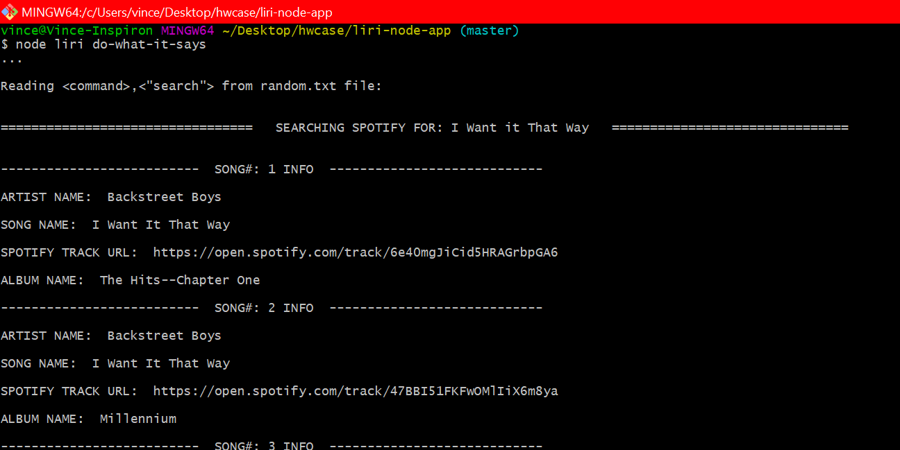

# liri-node-app

Welcome to my LIRI Application if you like it please check out my [Github Profile](https://github.com/Vincent440) to see my repositories.

Don't forget to view my [Github Portfolio page](https://vincent440.github.io/) well you are there Thanks!

LIRI is a _Language Interpretation and Recognition Interface_. LIRI is designed to be a command line node app that takes in parameters and displays data to the console.

   * LIRI will search:

     * Spotify for songs

     * Bands in Town for concerts

     * OMDB for movies.

   * Using Axios to make the calls to Bands In Town API & OMDB API

   * Using the node-spotify-api npm package to make the spotify API calls 

   * Utilizing Inquirer npm  to take in user input for addional searches & Allow more then one command to be ran each execution of the application. 

---

## This application Allows the user to search 3 different API's determined by the inputted command line arguements. 

The liri command line node application allows you to search three separate APIs quickly in one application to display Data, using keywords for the commands to determine which API to search then the app will display the results of that API's response to the console after api request is done. 

    LIRI will then prompt the user to see if they would like to search again. 

    If they select NO,
     the liri.js process will terminate.

    If they select YES,
     liri will then display a list of the three possible commands to search from.
     Once a command is selected the user can type what they would like that command to search.

 _If any of the searches an error occurs the error data will display and prompt the user to select Yes or no to if they would like to ask another question, default: No, closes the app. Answering Yes allows you to search again until you select no to the Search again prompt._ 

### How the liri.js App works

   * node liri spotify-this-song < song name > [Spotify API Track Search Endpoint](https://developer.spotify.com/console/get-search-item/)

   * node liri movie-this < movie name > [OMDB API](http://www.omdbapi.com)

   * node liri concert-this < artist or band > [Bands In Town API](http://www.artists.bandsintown.com/bandsintown-api)

   * node liri do-what-it-says     _(will read from the random.txt file.)_

   *The LIRI application utilizes and requires these npm packages:*

  * [Moment](https://www.npmjs.com/package/moment)

  * [DotEnv](https://www.npmjs.com/package/dotenv)

  * [Axios](https://www.npmjs.com/package/axios)

  * [inquirer](https://www.npmjs.com/package/inquirer)

  * [node-spotify-api](https://www.npmjs.com/package/node-spotify-api)

---

## Getting Started with the LIRI node command line application

_**WARNING: If you are not familiar with the bash/terminal this app may not be suitible for you but feel free to try anyways**_.

Welcome user! So you want to use my command line node app? Okay! lets get started.

You are going to need to have [Node.js](https://nodejs.org/en/) Installed in order to run this javascript file in the terminal or command line.
 
Assuming you are familiar with node as well as the terminal/cli and are ready to move on continue to the next steps 


* STEP ONE: You will need to go to my [Github](https://github.com/Vincent440/liri-node-app) repository, you can then either fork the repository and copy the Clone with HTTPS link
  then run the following command with the link copied from your forked version of the repo to replace what comes after "git clone" from your terminal
  or bash window or clone my repository the same way using the link on my Github repo the command will look like this in the terminal/CLI:

```
git clone https://github.com/Vincent440/liri-node-app.git
```
Running that command on your computers terminal or command line will download the repository to your computers local drive. and you should see the following :

 

Once you have the files go into that folder that contains the liri.js to this you should just have to enter the command into the terminal next:

```
cd liri-node-app/
```


* STEP TWO: You will have to run npm install to download the required npm packages in order for the application to function. that command will look like:

```
npm install
npm i
```
After running that command in the terminal you should have all the required packages installed a package-lock.json file created with a node modules directory made and populated with the required files.

You should see a screen similar to this you run npm install:


* STEP THREE: You are going to need to create a .env file in the same directory (this is where your Spotify api ID & Secret will go later). After you have all the files created you will need to make sure you have an API Key for each of the API's. Two are included in the REPO you will however need a Spotify Key Visit [Spotifys Developer page here](https://developer.spotify.com/my-applications/#!/applications/create) to get one. Your spotify api key will go in the **.env** file which will look like : 

```
# Spotify API keys

SPOTIFY_ID=YOUR SPOTIFY API ID WILL NEED TO BE STORED HERE
SPOTIFY_SECRET=YOUR SPOTIFY SECRET WILL NEED TO BE STORED HERE 

```

* FINALLY: Once you have the Spotify ID & Secret in place of the text above after the "=". you will be ready to run the liri.js application in the terminal to use it!

  Open up your terminal/bash CLI and SEE BELOW for a preview of the application in use to help you get started!

--- 


#   __Click here to watch the [liri.js Demo Video On Youtube](https://youtu.be/nqmej0YH9MI)__  __*Below are Example screenshots of running the liri application*__

---

Once you have searched for anything or if you didn't enter a valid command you will be prompted to select one of the three API call commands 

  * concert-this < Band/artist > will display:
     * Name of the venue
     * Venue location
     * Date of the Event (formatted as "MM/DD/YYYY" using moment)

  * spotify-this-song < song/track > will display:
     * Artist(s)
     * The song's name
     * A preview link of the song from Spotify
     * The album that the song is from

  * movie-this < movie/film > will display: 
       * Title of the movie.
       * Year the movie came out.
       * IMDB Rating of the movie.
       * Rotten Tomatoes Rating of the movie.
       * Country where the movie was produced.
       * Language of the movie.
       * Plot of the movie.
       * Actors in the movie.

Here are the four valid commands the liri application will accept initially running the application.

```
node liri concert-this A Day To Remember
node liri spotify-this-song Wake me up when september ends
node liri movie-this Guardians of the Galaxy Vol.2
node liri do-what-it-says
```

If no command is input such as "node liri" the npm inquirer package will be called and you will see the following prompt to select a command:


The following command will read from the random.txt file and display a search based off of the command before the "," and the search parameters that are in "qoutations" after the comma. 

```
node liri do-what-it-says
```

Will display or something similar depending on what text is inside the random.txt file:



The command:

```
node liri concert-this A Day To Remember
```

Will display: 


The command:
```
node liri spotify-this-song Wake me up when september ends
```

Will display: 


The command:
```
node liri movie-this Guardians of the Galaxy Vol.2
```

Will display: 


---

_This application was created by **Vincent Shury** for the Case Western Reserve University Coding Bootcamp._